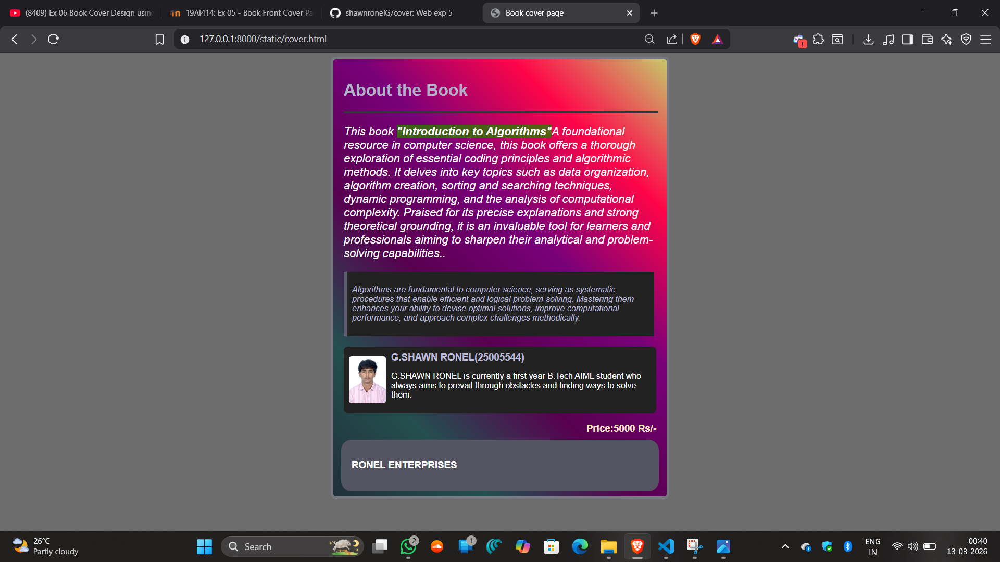

# Ex.05 Book Cover Page Design
## Date:13/03/2026

## AIM:
To design a book back cover page using HTML and CSS.

## DESIGN STEPS:

### Step 1:
Create a Django Admin project.

### Step 2:
Create an app in the Django interface.

### Step 3:
Create a folder named 'static' in the app folder.

### Step 4:
Create a new HTML file in the static folder.

### Step 5:
Write the HTML code with relevant CSS properties.

### Step 6:
Choose the appropriate style and color scheme.

### Step 7:
Insert the images in their appropriate places.

### Step 8:
Publish the website in the LocalHost.

## PROGRAM:
```

<html>
    <head>
        <title>Book cover page</title>
        <style>
            body{
    background-color:rgb(109, 108, 108);
    font-family: sans-serif;
}
.container{
    position: relative;
    background:linear-gradient(45deg,rgb(215, 233, 246),rgb(36, 79, 79),rgb(88, 0, 80),rgb(121, 0, 121),rgb(255, 5, 72),rgb(199, 199, 106));
    background-size:cover;
    width:600px;
    height:800px;
    margin:auto;
    padding:20px;
    border:5px solid rgb(70, 70, 82);
    border-radius:10px;
}
.header h1{
    color:rgb(86, 86, 106);
    text-align:left;
}
.header hr{
    width: 600px;
    border:2px solid rgb(63, 63, 83);
}
.content{
    font-size:22px;
    color:black;
    padding:0;
    font-style:italic;
}
.highlight{
    background-color:rgba(46, 121, 0, 0.784);
    font-weight:bold;
}
.quotes{
    margin: top 20px;;
    width:570px;
    background:whitesmoke;
    border-left:6px solid rgb(97, 97, 128);
    padding:10px;
    font-style:italic;
    color:rgb(79, 79, 107);
}
.author{  
    margin-top: 20px;
    display:flex;
    background:whitesmoke;
    padding:10px;
    border-radius:8px;
    align-items:center;
}
.author img{
    width:75px;
    height:90px;
    border-radius:5px;
    margin-right:10px;
}
.author-text h3{
    margin:0;
    color:rgb(77, 77, 103);
}
.footer{
    position:absolute;
    bottom:10px;
    left:15px;
    right:15px;
    background:rgb(84, 84, 99);
    color:white;
    padding:20px;
    display:flex;
    justify-content:space-between;
    border-radius:20px
}
.footer h3{
    display:inline;
    box-shadow:rgb(68, 68, 81);
}
.price{
    float:right;
    color:bisque;
    bottom:auto;
}

        </style>
    </head>
    <body>

        <div class="container">
            <div class="header">
                <h1>About the Book</h1>
                <hr>
            </div>

            <div class="content">
                <p>This book <span class="highlight">"Introduction to Algorithms"</span>A foundational resource in computer science, this book offers a thorough exploration of essential coding principles and algorithmic methods. It delves into key topics such as data organization, algorithm creation, sorting and searching techniques, dynamic programming, and the analysis of computational complexity. Praised for its precise explanations and strong theoretical grounding, it is an invaluable tool for learners and professionals aiming to sharpen their analytical and problem-solving capabilities..</p>
            </div>
            <div class="quotes">
                <p>Algorithms are fundamental to computer science, serving as systematic procedures that enable efficient and logical problem-solving. Mastering them enhances your ability to devise optimal solutions, improve computational performance, and approach complex challenges methodically.</p>
            </div>
            <div class="author">
                
                <div class="author-text">
                    <h3>G.SHAWN RONEL(25005544)</h3>
                    <p>G.SHAWN RONEL is currently a first year B.Tech AIML student who always aims to prevail through obstacles and finding ways to solve them.</p>
                </div>
            </div>
            <div class="footer">
                <h3>RONEL ENTERPRISES </h3>
            </div>
            <div class="price">
                <h3>Price:5000 Rs/-</h3>
            </div>
        </div>
    </body>
    </html>
```
## OUTPUT:


## RESULT:
The program for designing book back cover page using HTML and CSS is completed successfully.
